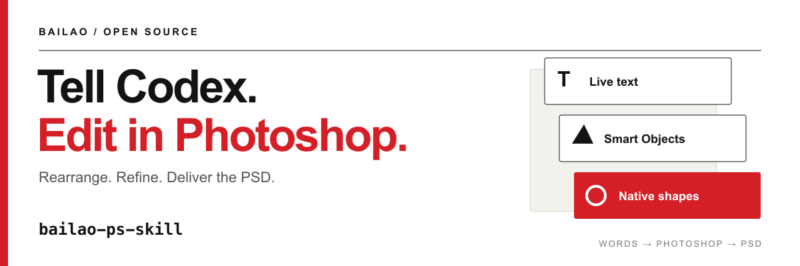

<p align="center">
  
</p>

<p align="center">
  <strong>Tell Codex what you want in plain language. Rearrange designs, make edits and deliver a PSD from Photoshop.</strong><br>
  An open-source Codex skill for people using AI images, designers and small teams.
</p>

<p align="center">
  <a href="#get-started">Get started</a> ·
  <a href="#what-you-can-do">Use cases</a> ·
  <a href="docs/installation.md">Photoshop setup</a> ·
  <a href="README.zh-CN.md">简体中文</a>
</p>

<p align="center">
  <a href="docs/media/photoshop-demo.mp4"></a><br>
  <sub>Photoshop demo · includes illustrative transitions · <a href="docs/media/photoshop-demo.mp4">Watch with sound</a></sub>
</p>

## Your AI image is ready. Keep editing in Photoshop.

You like the image, but the layout needs changing, the headline needs an update, or the details do not fit yet. Tell Codex what you want and let it continue the work in Photoshop.

**bailao-ps-skill** packages the workflow I use into reusable instructions and tools. Starting from an AI image or reference, it guides Codex through preparing separate assets and rebuilding a layered PSD for further changes. If you already have a PSD, work can continue on a copy of its existing layers.

Photoshop users can finish details themselves. People unfamiliar with the controls can describe changes in plain language, review the result and refine it. Photoshop and a working local control route are required.

## What you can do

| Task | Ask for | Result |
| :--- | :--- | :--- |
| Reuse assets across layouts and sizes | Make this portrait, keep the assets and give the information more room | A PSD with elements rearranged for the new composition |
| Update text and information | Replace the headline and details, preserve the approved design | Revised live text and spacing |
| Use selected reference elements | Keep only this object and these graphic shapes | Independent assets or layers with reconstruction gaps explained |
| Complete missing assets | Generate this object separately and place it back into the design | A reference-guided asset when a suitable image tool is available |
| Deliver and keep revising | Check the saved document and export the design | Layered PSD, PNG/JPG and required assets |

Keep text live where possible, suitable graphics as native shapes and paths, and complex objects as separate replaceable Smart Objects. Name and group layers by purpose, then reopen the saved file to check it.

Hidden content in a flattened image needs inference, repair or reconstruction; its original layer history cannot be recovered. Asset generation requires an available tool. Font substitutions, raster details and the actual scope of editability should be explained with the result.

## Get started

Use **Codex with Photoshop 2026 on macOS or Windows**. Photoshop must be installed on the same computer as Codex's local tools. See [setup](docs/installation.md) for platform-specific commands and the verified Windows environment.

1. Use **Code → Download ZIP** and unzip the repository.
2. Rename the folder to `bailao-ps-skill` and place it in `~/.codex/skills/`, with `SKILL.md` directly inside. If you set `CODEX_HOME`, use its `skills/` directory.
3. Start a new Codex session. Follow the [setup guide](docs/installation.md) to confirm Photoshop access before the first task.
4. Attach an image or PSD and describe the changes.

```text
Use $bailao-ps-skill.
Keep the subject and overall style, and rearrange this design into 1080 × 1920.
If the input is flat, rebuild the elements that need independent editing.
If it is already a PSD, reuse its existing layers.
Place the headline above the subject, enlarge the subject and rearrange the details.
Preserve the approved wording. Open the result in Photoshop for review,
then check and deliver the PSD and a PNG.
```

The skill supplies instructions and scripts. Local scripting or available UI tools operate Photoshop; installing the skill does not install Photoshop or grant OS permissions. See the [setup guide](docs/installation.md) for dependencies and the first check.

## More ways to ask

**Keep the design, update the content**

```text
Use $bailao-ps-skill on a copy of this PSD.
Change the headline to “YOUR NEXT CHAPTER” and use the attached updated details.
Keep the subject and palette. Adjust spacing and check clipping and overlaps.
```

**Use only selected elements**

```text
Use $bailao-ps-skill. I only need the object and red graphics from this image.
Prepare them as separate elements and create a new square layout.
Explain any hidden or missing regions; check available tools if generation is needed.
```

## Technical reference

Codex interprets the request and plans the design. The scripts execute an explicit layer plan; asset preparation, layout decisions and visual review are part of the overall workflow.

| Topic | Reference |
| :--- | :--- |
| Installation, permissions and first run | [Setup guide](docs/installation.md) |
| Agent workflow | [SKILL.md](SKILL.md) |
| Text, vectors, masks, effects and the builder | [Manifest runner](references/manifest-runner.md) |
| Font matching and typography | [Typography](references/typography.md) |
| Separate assets and transparent edges | [Photo cutouts](references/photo-cutouts.md) |
| Environment and feature boundaries | [Supported scope](docs/status.md) |
| Delivery checks | [Quality protocol](references/quality-protocol.md) |

## Scope

Complex reconstruction can require iteration. Review wording, assets, layout and the reopened file. Results depend on the reference, fonts, assets and tool environment; there is no universal accuracy or completion-time guarantee. Other agent integrations have not been validated. The optional Vision OCR helper and automatic font installation are macOS-only.

## Contributing

Issues, small reproducible examples and fixes are welcome. Include your environment, requested outcome and actual result. Only attach material you can share publicly.

## License

Instructions and scripts use the [MIT License](LICENSE). Fonts and third-party design assets are not bundled. Photoshop and Codex require their own available product environments. This is an independent project by **bailao**; Photoshop is an Adobe product.
