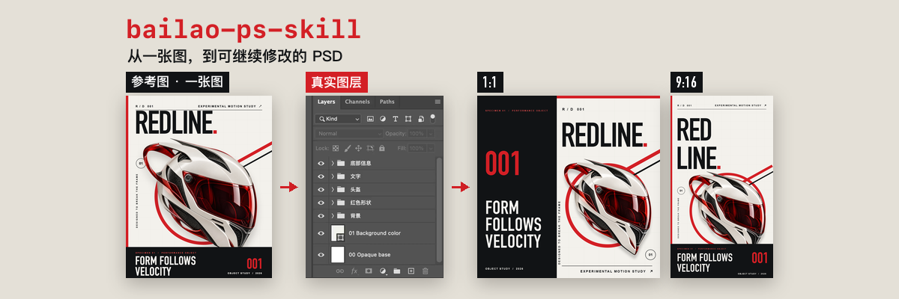
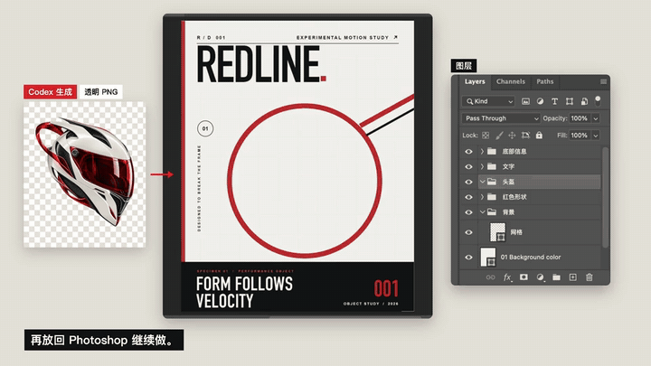

<p align="center">
  
</p>

<p align="center">
  <strong>用白话让 Codex 操作 Photoshop，帮你重新排版、修改设计，直接交付 PSD。</strong><br>
  给已经在用 AI 生图的人、设计师和小团队的开源 Codex skill。
</p>

<p align="center">
  <a href="https://github.com/bailao-onx/bailao-ps-skill/releases/latest/download/bailao-ps-skill-github-ready.zip"><strong>⬇ 下载 ZIP</strong></a>
</p>

<p align="center">
  <a href="#开始使用">开始使用</a> ·
  <a href="#你可以让它做什么">使用场景</a> ·
  <a href="docs/installation.md">安装与 Photoshop 接通</a> ·
  <a href="README.md">English</a>
</p>

<p align="center">
  <a href="docs/media/bailao-psd-demo-1080p.mp4"></a><br>
  <sub>Photoshop 演示（含示意转场） · <a href="docs/media/bailao-psd-demo-1080p.mp4">观看有声版</a></sub>
</p>

## AI 图有了，接着在 Photoshop 里改

画面已经满意，只是排版想换一下、标题要改、资料还没放对。你可以把这些要求直接告诉 Codex，让它操作 Photoshop，继续处理设计。

**bailao-ps-skill** 把我平常用的这套流程整理成了可复用的指令和工具。从一张 AI 图或 reference 开始，它会引导 Codex 准备独立素材、重建分层 PSD，再继续调整；已经有 PSD，也可以直接在副本上修改。

会 Photoshop，可以自己进去改细节。不熟悉操作，也可以用白话描述要求，看稿后继续调整。开始前需要安装 Photoshop，并接通 Codex 的本机操作权限。

## 你可以让它做什么

| 你要做的事 | 可以这样说 | 得到什么 |
| :--- | :--- | :--- |
| 同一套素材换 layout 或尺寸 | 保留素材，重新排成竖版，标题放上面，资料别挤在一起 | 按新尺寸重新安排元素的 PSD |
| 改文字和资料 | 换掉标题，更新这段资料，保留其他已确认内容 | 可继续修改的文字与布局 |
| 只用 reference 里的某些元素 | 我只要这个物件和红色图形，帮我单独处理 | 独立素材或图层，并说明需要补全的部分 |
| 缺少完整素材 | 这个物件被挡住了，单独生成完整素材再放回来 | 生图工具可用时，生成并匹配设计的独立素材 |
| 交付及后续修改 | 检查文件，给我 PSD 和对应成图 | 分层 PSD、PNG/JPG 与需要的素材 |

文字尽量保留为活字，适合的图形用原生形状和路径，复杂物件以独立、可替换的智能对象处理。图层按用途命名和分组，保存后重新打开检查。

扁平图片里的隐藏部分需要推测、补全或重建，不能恢复原本的图层历史。生成素材需要可用的生图工具；字体替代、位图细节和实际可编辑范围会在交付时说明。

## 开始使用

### [⬇ 下载 ZIP](https://github.com/bailao-onx/bailao-ps-skill/releases/latest/download/bailao-ps-skill-github-ready.zip)

使用 **Codex + Photoshop 2026**，可通过 macOS 或 Windows 本机脚本接通。Photoshop 需要安装在运行 Codex 本地工具的同一台电脑；平台对应命令与已验证的 Windows 环境见 [安装说明](docs/installation.md)。

1. 点击 **[下载 ZIP](https://github.com/bailao-onx/bailao-ps-skill/releases/latest/download/bailao-ps-skill-github-ready.zip)**，然后解压下载的文件。
2. 把解压出来的 `bailao-ps-skill` 文件夹放入 `~/.codex/skills/`，确认里面直接包含 `SKILL.md`。若设置了 `CODEX_HOME`，使用该目录下的 `skills/`。
3. 开一个新的 Codex 会话。首次使用先按 [安装说明](docs/installation.md) 确认 Photoshop 能被操作。
4. 附上图片或 PSD，告诉 Codex 想改什么。

```text
使用 $bailao-ps-skill。
保留这张图的主体和整体风格，帮我重新排成 1080 × 1920 的竖版。
如果输入是平面图，先重建需要独立编辑的元素；如果已经是 PSD，复用现有图层。
标题放上方，主体放大，资料重新安排，保留已确认的文字。
完成后在 Photoshop 里打开给我看，检查后交付 PSD 和 PNG。
```

Skill 提供指令和脚本，Photoshop 操作通过本机脚本或可用的界面工具完成。安装 Skill 不会自动安装 Photoshop 或授予系统权限。依赖和首次检查见 [安装说明](docs/installation.md)。

## 再试两个要求

**保留设计，修改内容**

```text
使用 $bailao-ps-skill，在这份 PSD 的副本上修改。
把标题换成「下一站，由你开始」，更新我附上的资料。
保留主体和配色，调整间距，检查文字遮挡和出界。
```

**只取需要的元素**

```text
使用 $bailao-ps-skill。我只需要这张图里的物件和红色图形。
请准备成独立元素，再做一个新的方形排版。
被遮挡或缺失的部分请说明；需要生成素材时，先检查可用工具。
```

## 技术资料

Codex 按要求分析和规划设计，脚本负责执行明确的图层计划；素材准备、排版判断和看稿检查仍属于完整流程的一部分。

| 内容 | 资料 |
| :--- | :--- |
| 安装、权限与第一次运行 | [安装说明](docs/installation.md) |
| Skill 工作流程 | [SKILL.md](SKILL.md) |
| 文字、矢量、蒙版、效果与构建器 | [Manifest runner](references/manifest-runner.md) |
| 字体匹配和排字 | [Typography](references/typography.md) |
| 素材分离与透明边缘 | [Photo cutouts](references/photo-cutouts.md) |
| 功能与环境边界 | [支持范围](docs/status.md) |
| 交付检查方法 | [Quality protocol](references/quality-protocol.md) |

## 使用范围

复杂重建可能需要反复调整；请检查文字、素材、布局和保存后的文件。结果受参考图、字体、素材和工具环境影响，没有统一的准确率或完成时间保证。其他 agent 的接入尚未验证。可选的 Vision OCR 和字体自动安装辅助工具仅适用于 macOS。

## 参与改进

欢迎提交问题、可复现的小例子和修复。描述你的环境、想做什么，以及实际发生了什么；请只附上可以公开的素材。

## 许可

指令和脚本采用 [MIT License](LICENSE)。字体及第三方设计素材不包含在发布包内。使用 Photoshop 和 Codex 需要各自可用的产品环境。这是 **bailao** 的独立项目，Photoshop 为 Adobe 产品。
